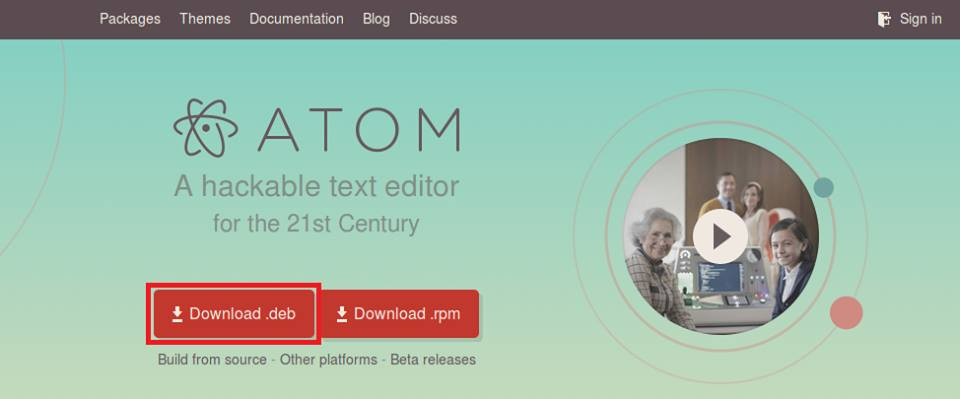
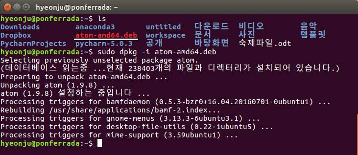
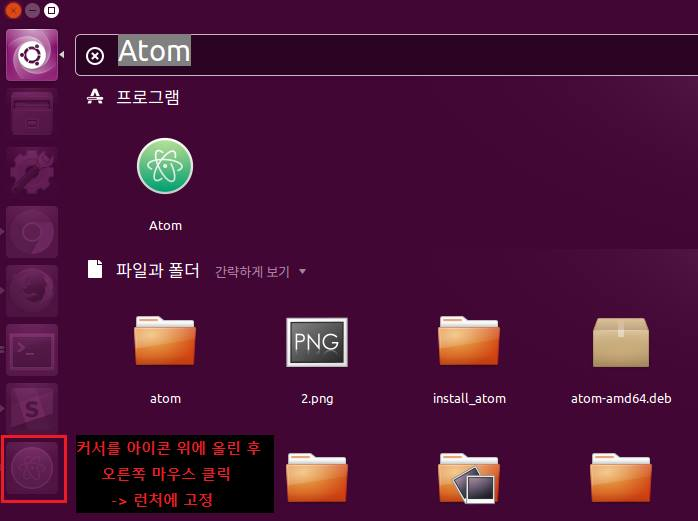
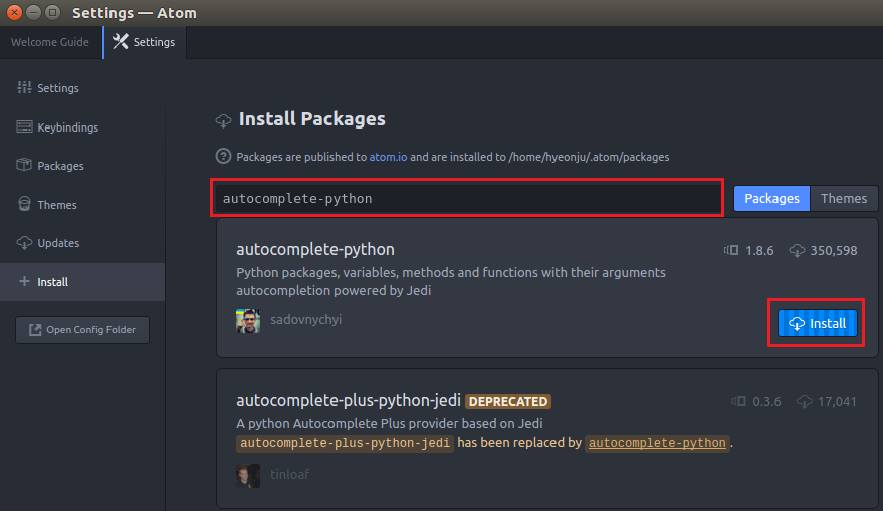
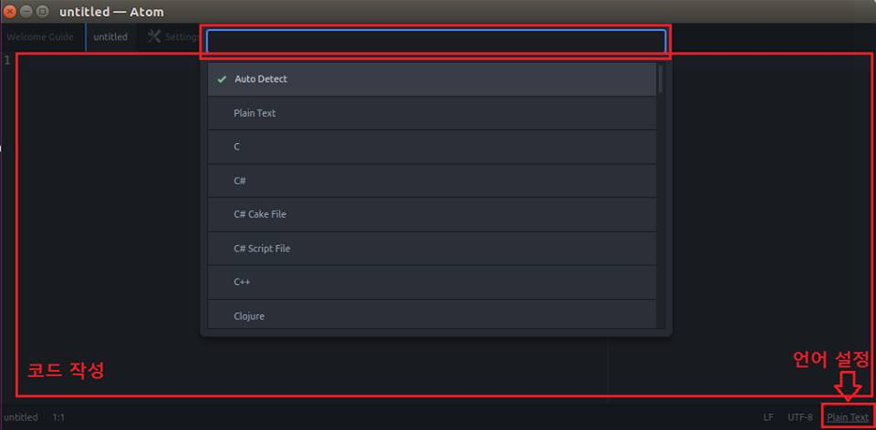

# Ubuntu 에서 Atom 설치 및 실행하기

  Atom은 Github에서 만든 에디터로 다양한 프로그래밍 언어의 편집기로 사용할 수 있도록 고안된 도구이다. 무료이며 플로그인으로 기능을 쉽게 확장할 수 있다. 또한 HTML, CSS, JavaScript와 같은 웹기술로 화면을 구현했기 때문에 웹페이지를 편집하듯이 UI를 제어할 수 있다.

## 1. Atom Editor 설치하기

### 1) 설치 파일 다운받기
  
#### (1) Atom 페이지에서 설치 파일 다운받기 
Atom 공식 페이지 [https://atom.io/](https://atom.io/)  메인 화면에서 Download.deb 버튼을 클릭하여 파일을 다운받는다. (리눅스 계열중 레드햇 계열(CentOS, 페도라 등)을 사용 중이라면 Download.rpm 버튼을 눌러 다운받으면 된다.)

#### (2) 터미널에서 Atom 설치 파일 다운받기

   터미널(Ctrl+Alt+T)을 열어 command line 에 아래 명령어를 입력한다.
  
  
#####  -  데비안 계열(Ubuntu, Debian)
> wget -o atom.deb https://atom.io/download/deb

#####  -  레드햇 계열(Ubuntu, Debian)
> wget -o atom.deb https://atom.io/download/rpm

### 2) 파일 설치 전에 터미널 창에서 아래 두 명령어를 실행하여 Atom 실행에 필요한 패키지를 설치한다. (Atom은 의존성 패키지가 존재하기 때문이다.)

> sudo apt-get install aptitude

> sudo aptitude install gvfs-bin

### 3) Atom.deb 파일이 위치한 디렉토리에서 아래 명령어를 실행하여 설치를 시작한다.

> sudo dpkg -i atom-amd64.deb (파일 이름은 다를 수 있다.)  

## 2. Atom Editor 에서 Python 코드 실행하기

### 1) Window 키를 눌러 검색창을 연 후 Atom 파일을 검색하여 Atom Editor를 실행시킨다.
  (런처에 고정을 시키고 싶다면 실행 후 런처에서 오른쪽 버튼을 눌러 "런처에 고정"을 클릭한다. 프로그램을 런처에 고정하면 검색하지 않고도 편하게 Atom Editor 를 실행시킬 수 있다.)

  

### 2) Python 실행에 필요한 패키지 설치하기

#### (1) 에디터 실행 후 ctrl + comma(Ctrl + ,) 단축키를 입력해 Settings 메뉴에 들어간다
  (설정화면에서는 Atom 설정 및 패키지나 테마의 설치, 삭제, 업데이트, 단축키 등을 변경할 수 있다.)
#### (2) Install 을 클릭하여 Python 실행에 필요한 아래 두 패키지를 설치한다.
> __autocomplete-python__   
  
> __script__

### 3) Python 코드 실행하기
   
#### (1) File - New File을 클릭하여 새로운 파일을 만든다.
#### (2) 오른쪽 하단에 언어 설정이 Python이 아니라면(ex. Plain text, C 등) 클릭하여 Python으로 설정을 바꿔준다.
#### (3) 실행하고 싶은 Python 코드를 작성한다.  (ex. print("hello"))
#### (4) Ctrl + Shift + b 단축키를 눌러 코드를 실행시킨다.

